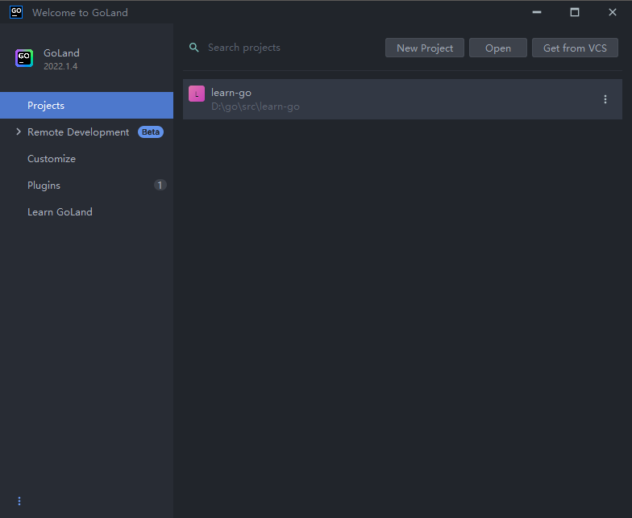
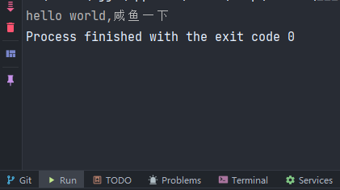
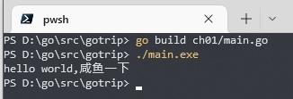

# Go语言学习笔记-01开发环境搭建

## 下载地址

https://go.dev/dl/

## windows平台

1.根据系统位数下载对应安装包，64位下载`amd64.msi`结尾的文件，32位下载`386.msi`结尾的文件


2.双击打开安装包，一路Next，等待安装结束

3.打开终端，输入`go version`，若安装成功，会有以下输出


4.设置`GOPROXY`环境变量，加速go库的下载
在终端输入

```powershell
go env -w https://mirrors.aliyun.com/goproxy/,https://goproxy.cn,https://goproxy.io,direct
```
查看设置结果
```powershell
go env
```


## 编辑环境搭建

### Goland

1.下载地址
https://www.jetbrains.com.cn/go/download/other.html
选择2022.1.4版本，默认免费30天试用
根据系统选择对应安装包


2.安装完后打开，注册一个账号  

3.打开编辑器




3.点击New Project，选择Go（GOPATH），创建一个项目


4.安装主题插件

点击左上角File->Settings，找到Plugins

搜索`Atom Material Icons`，点击Install

搜索`One Dark theme`，点击Install


设置主题，字体，字体大小


5.hello world

右键`gotrip`新建目录`ch01`,并在`ch01`下创建`main.go`文件


输入以下代码

```go
package main

import "fmt"

func main() {
	fmt.Print("hello world,咸鱼一下")
}
```

点击运行


运行结果



第二种运行方法

在终端输入

```powershell
go run ch01/main.go
```


第三种运行方法

在终端输入

```powershell
go build ch01/main.go
```

此时会编译出一个执行文件`main.exe`

在终端输入

```powershell
./main.exe
```



## 笔记地址
github：https://github.com/xianyuyixia/gotrip

## 交流学习

微信搜索『闲渔一下』或『xianyyxia』关注公众号

个人wx『xianyuyixia』